<p align="center">
  <a href="https://openface.live">
    
  </a>
</p>

<p align="center">
  <a href="https://github.com/thcapp/openface/actions"></a>
  <a href="LICENSE"></a>
  <a href="https://openface.live"></a>
  <a href="https://oface.io"></a>
</p>

---

## Quick Start

```bash
bun install
bun run dev          # Start face server on :9999
```

Push state from anywhere:

```bash
curl -X POST http://127.0.0.1:9999/api/state \
  -H "Content-Type: application/json" \
  -d '{"state":"speaking","emotion":"happy","text":"Hello!"}'
```

## Web Component

```html
<script type="module" src="https://openface.live/open-face.js"></script>
<open-face state="idle" emotion="neutral"></open-face>
```

Connect to a live server:

```html
<open-face server="ws://localhost:9999/ws/viewer"></open-face>
```

Built-in text-to-speech (no TTS server needed):

```html
<open-face server="ws://localhost:9999/ws/viewer" tts></open-face>
```

## Hosted Faces

Get a permanent URL at [oface.io](https://oface.io) — no server needed:

1. Sign in with GitHub at [openface.live](https://openface.live)
2. Claim a username — you'll get an API key
3. Push state from your agent:

```bash
curl -X POST https://oface.io/mybot/api/state \
  -H "Authorization: Bearer oface_ak_..." \
  -d '{"state":"speaking","emotion":"happy","text":"Hello!"}'
```

Anyone can watch at `oface.io/mybot`. Manage your faces at [openface.live/account](https://openface.live/account).

## Expression System

| | Options |
|---|---|
| **States** | idle, thinking, speaking, listening, reacting, puzzled, alert, working, sleeping, waiting, loading |
| **Emotions** | neutral, happy, sad, confused, excited, concerned, surprised, playful, frustrated, skeptical, determined, embarrassed, proud |
| **Eyes** | 12 styles, 10 pupil shapes, 8 specular shapes |
| **Mouth** | 10 shapes |
| **Head** | 12 shapes |
| **Plus** | 8 brow styles, 7 eyelash styles, 6 nose styles, 10 face decorations, per-eye overrides, dual-color system, body module, accessories |

Blend emotions: `{ "emotion": "happy", "emotionSecondary": "surprised", "emotionBlend": 0.4 }`

## Packages

| Package | Description |
|---------|-------------|
| [`@openface/renderer`](packages/renderer/) | Canvas2D engine + face generator (zero deps) |
| [`@openface/element`](packages/element/) | `<open-face>` web component |
| [`@openface/server`](packages/server/) | Bun WebSocket relay + HTTP API |
| [`@openface/client`](packages/client/) | TypeScript client library |
| [`@openface/mcp`](packages/mcp/) | MCP server (8 tools for Claude) |
| [`@openface/server-edge`](packages/server-edge/) | Cloudflare Workers + Durable Objects |
| [`@openface/filter`](packages/filter/) | Output filtering + emotion detection |
| [`@openface/plugin`](packages/plugin/) | OpenClaw lifecycle plugin |

## Integrations

**MCP** — 8 tools for Claude: set_face_state, face_speak, set_face_look, face_wink, set_face_progress, face_emote, get_face_state, face_reset

**Client Library:**

```js
import { OpenFaceClient } from "@openface/client";
const face = new OpenFaceClient("http://127.0.0.1:9999");
await face.setState({ state: "thinking", emotion: "determined" });
await face.speaking("Hello!");
```

**Filter** — normalizes raw AI output into clean state updates. Provider extractors for Claude, OpenAI, Gemini, Ollama.

**OpenClaw Plugin** — `cp -r packages/plugin ~/.openclaw/plugins/openface`

## Audio Pipeline

Single authority model — no race conditions:

| Authority | Owns | Transport |
|-----------|------|-----------|
| Plugin / Agent | State transitions | `/api/state`, `/api/speak` |
| TTS Server | Audio delivery | `/api/audio`, `/api/audio-done` |
| Viewer | Amplitude | Web Audio API RMS extraction |

**Built-in TTS fallback**: Add the `tts` attribute to `<open-face>` for browser-native speech synthesis. No TTS server needed. External audio always takes priority.

## Server API

```
POST /api/state          Push state update
POST /api/speak          Start speaking (atomic seq increment)
POST /api/audio          Relay audio chunks to viewers
POST /api/audio-done     End audio stream
GET  /api/state          Read current state
GET  /health             Health check
WS   /ws/viewer          Receive state + audio
WS   /ws/agent           Push state
```

## Face Packs

Default is the only built-in pack. Community packs live in `faces/community/` and load on-demand.

Each pack is a `.face.json` defining geometry, colors, animation, and personality. Create your own in the [builder](https://openface.live/builder) or browse the [gallery](https://openface.live/gallery).

## Protocol

JSON state messages over HTTP or WebSocket. Full spec: [protocol/v1/spec.md](protocol/v1/spec.md)

Schemas: [state.schema.json](protocol/v1/state.schema.json) | [face.schema.json](protocol/v1/face.schema.json)

## Development

```bash
bun install              # Install dependencies
bun run dev              # Build + start server on :9999
bun run test             # 362+ tests
bun run build            # Build all targets
```

## License

MIT
